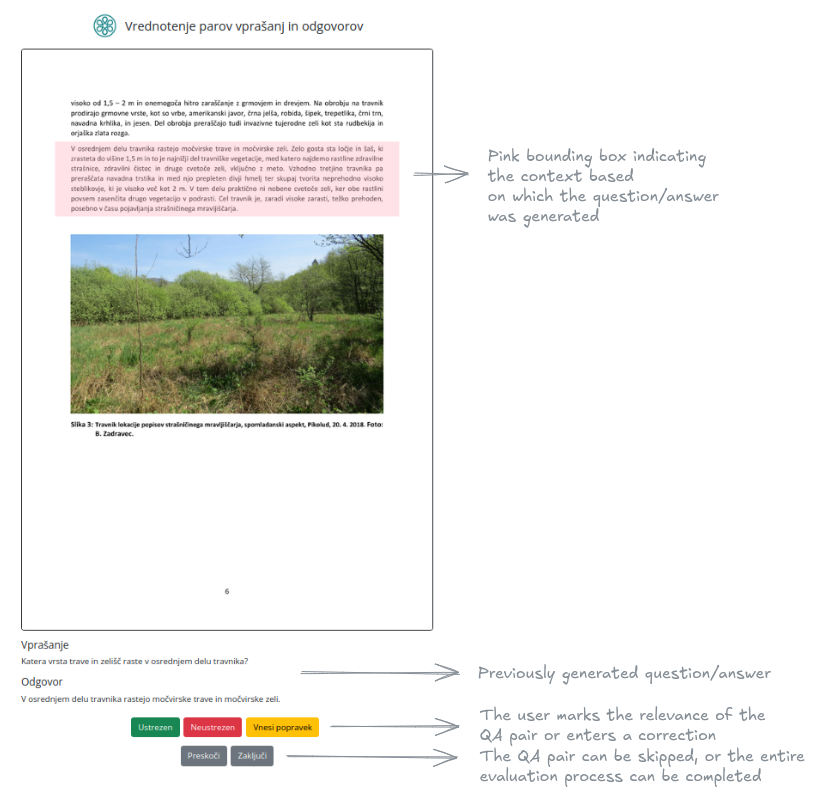

# Ground Truth QA Evaluation

System for generating and evaluating question–answer pairs from PDF documents using LLMs.



*Example of the QA evaluation interface.*  
*As you can see, most user-facing text was originally written in Slovene, reflecting the principal target users.*

## About the project

The system implements a two-phase approach for creating high-quality QA pairs:  
- **Phase 1:** Automatic generation of question–answer pairs from text segments of PDF documents using an LLM (default choice is Azure OpenAI – GPT-4o-mini).  
- **Phase 2:** Human evaluation and correction of generated pairs through a web interface.

> **The development of this application was based on a Jupyter notebook by [EyeLevel](https://www.eyelevel.ai/), available here:**  
> https://github.com/groundxai/code-samples/blob/master/notebooks/RAGMasters_QAGenWithHuman.ipynb

## Features

- Processing of JSON files containing text segments extracted from PDF documents
- Generation of 2 question–answer pairs per text segment using an LLM
- Secure linking to PDF documents via S3/MinIO storage
- Web interface for sequential evaluation of QA pairs
- Display of PDF pages with highlighted bounding boxes of text segments
- Ability to edit and correct generated questions and answers
- Storage of feedback for later analysis and potential evaluation of RAG systems themselves

## Technical requirements

- Python 3.8+
- FastAPI for the web server
- Azure OpenAI API access
- MinIO/S3 storage for PDF documents
- PyMuPDF (fitz) for rendering PDF pages
- PIL/Pillow for image processing

## Installation

1. Clone the repository:
    ```bash
    git clone https://github.com/gregorgatej/ground-truth-qa.git
    cd ground-truth-qa
    ```

2. Install dependencies:
    ```bash
    pip install fastapi uvicorn python-dotenv minio openai pydantic PyMuPDF pillow requests jinja2
    ```

3. Create a `.env` file with the following variables:
    ```
    ZRSVN_AZURE_OPENAI_ENDPOINT=your_azure_endpoint
    ZRSVN_AZURE_OPENAI_KEY=your_azure_openai_key
    S3_ACCESS_KEY=your_s3_access_key
    S3_SECRET_ACCESS_KEY=your_s3_secret_key
    ```

4. Prepare the folder structure:
    ```bash
    mkdir -p preprocess_data app_data static assets templates
    ```

## Usage

### 1. Data preprocessing

Place JSON files (i.e., the result of the first phase of the preprocessing pipeline in [zrsvn-rag-preprocessing](https://github.com/gregorgatej/zrsvn-rag-preprocessing)) containing text segments into the `preprocess_data/` folder and run:

```bash
python preprocess.py
```
The script will:

- Process all JSON files in the preprocess_data/ folder
- Generate 2 question–answer pairs for each text segment (minimum 512 characters)
- Save the results into app_data/qa_data.json

### 2. Web evaluation

Start the web server:

```bash
uvicorn app:app --reload --host 0.0.0.0 --port 8000
```
The QA reviewer can now open a browser at http://localhost:8000
 and:

- Review the displayed question–answer pairs
- Mark them as "Relevant", "Irrelevant", or "Skip"
- Edit and correct their content if necessary
- Feedback is stored in app_data/feedback.json